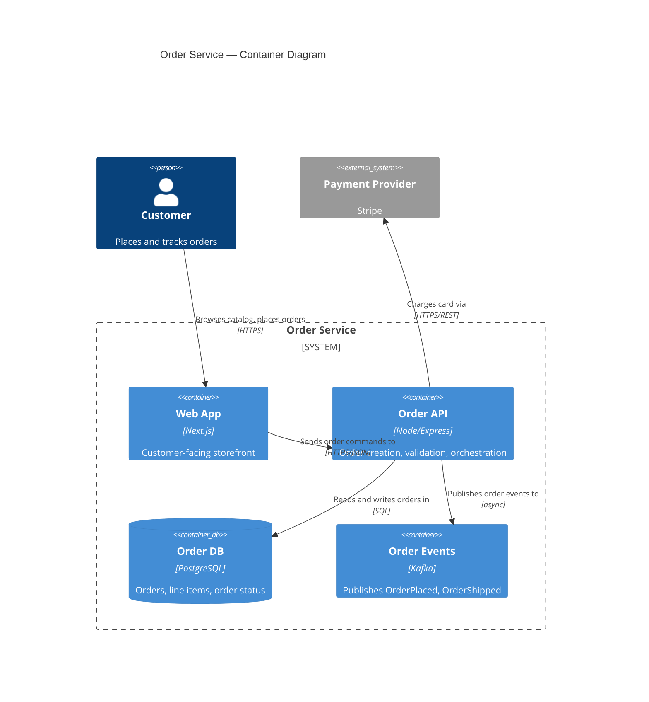

# C4 diagrams

C4 (Context, Container, Component, Code) documents a software system's *static structure* — what pieces exist and how they depend on each other — at a chosen zoom level, the way Google Maps zooms from world map to street. It says nothing about order, timing, or decision logic; that's what the sequence and flowchart templates are for. Reach for C4 when the question is "what does this system look like and how is it put together," not "what happens when."

**When C4 is the wrong tool, even for architecture work**: a trivial system (one app, one database) doesn't need four levels of formalism — one plain box diagram says everything. A business process or decision tree belongs in a flowchart, not a Component diagram wearing C4's syntax. Physical infrastructure topology (VPCs, subnets, load balancers) is a deployment concern C4 doesn't model well in Mermaid — don't force it into a Container diagram.

## Pick the level

| Level | Shows | Audience |
|---|---|---|
| Context | The system as one box, the people who use it, and the other systems it talks to — no technology, no internal structure | Anyone, technical or not |
| Container | The system's deployable/runnable units (apps, databases, queues, mobile apps, SPAs) and how they communicate | Architects, engineers, ops |
| Component | One container's internal modules and how they collaborate | Engineers working inside that specific container |

**Code** (classes/interfaces inside one component) is real C4 but almost never worth hand-maintaining — modern IDEs reverse-engineer this from source on demand, and a manually kept Code diagram goes stale faster than any other level for the least payoff. Generate it from tooling when you need it; don't build it as a living doc.

**Component is the second most-skipped level, for good reason**: it's the fastest of the three to go stale (internal structure churns with every refactor) and its audience is the narrowest (only whoever works inside that one container). Build it only when a container is genuinely complex enough that its breakdown isn't obvious from its name, or right before a significant redesign of that container — not as a blanket requirement for every container in the system. A conventional CRUD service with a standard controller/service/repository shape doesn't need one; that structure is already predictable.

The most common mistake at any level: jumping straight to Container or Component without ever drawing Context, losing the big picture that gives the rest its meaning — and, separately, mixing two levels in one diagram (a whole container drawn next to another container's internal components confuses the zoom level the reader is supposed to be at).

## Context diagram

**Person vs. external system** is a question of ownership and deploy boundary, not "inside vs. outside the company." A `Person` is a human role interacting directly with the system (`Customer`, `Support Agent`) — you don't need to enumerate every job title, just the roles relevant to understanding who uses what. Anything else that exchanges data with your system but that you're not documenting in detail right now is an `External System` — a payment gateway, an internal service owned and deployed by another team, a third-party CRM. If it has its own deploy lifecycle and ownership, it's external to *this* diagram's scope, company-internal or not.

No technology and no internal structure at this level — the system being documented is still a single black box here, and any tech label ("React SPA") leaking into a Context diagram belongs one level down.

**Keep it to roughly 7-9 elements** (people + external systems combined). Past that, arrows cross the center and the diagram stops being readable in one look. When you have more real integrations than that, group related ones under one label ("Payment Providers" instead of naming Stripe, PayPal, and Adyen individually, unless the distinction actually matters to this diagram's audience) rather than listing every one.

## Container diagram

A "container" is any separately runnable/deployable unit that has to be running for the system to work — much broader than a microservice. It includes a server-side app, a single-page app running in the browser, a mobile app, a database (passive, but still a container — it stores and serves data), a message queue, a serverless function, even a batch script.

**Don't confuse this with a Docker container.** They're unrelated concepts that happen to share a name — C4's "container" predates Docker's popularity, and this collision is one of the most common sources of confusion when introducing C4 to a team that lives in Kubernetes/Docker daily. A C4 container might run inside a Docker container, or might not (a browser SPA, a mobile app, a managed database service aren't Docker containers at all). Say this explicitly when the audience is infra-heavy.

**`System_Boundary` is for when the diagram shows more than one system's containers** — your own system's containers plus a neighboring system's, drawn partially for integration context. It clarifies where your system ends and the neighbor's begins. When the diagram only shows one system's containers (the common case), the boundary is usually redundant — the diagram's own frame already does that job, and adding the dotted box just adds visual noise.

## Component diagram (when it's worth it)

A component is a cohesive grouping of related functionality behind a defined interface — usually a module or package, not an individual class (that's Code level in disguise). Examples: `Order Controller`, `Auth Service`, `User Repository`, `Payment Gateway Client`.

**Granularity rule of thumb: 5-15 components.** Fewer than that and you're probably redrawing the Container diagram with different labels (components too coarse to say anything useful, like "Business Logic"). More than that and you're likely at per-class granularity (Code level) — or it's a real signal the container itself is too big and should split into more than one.

## Relationships (`Rel`)

Label every relationship as **verb + object**, describing the real intent — "Sends order commands to", "Publishes payment-processed events to", "Authenticates users via" — never a bare "uses", "calls", or "communicates with", which tells a reader nothing about what actually happens. The arrow direction should reflect **who initiates the interaction**, not which way data conceptually flows — a polling consumer initiates the call even though the data "flows" from the provider, so the arrow points from consumer to provider.

Technology/protocol annotations (`JSON/HTTPS`, `gRPC`, `AMQP`) belong at Container level and below, in a separate line from the description — never at Context level, which is deliberately technology-free.

## Mermaid specifics and limitations

Mermaid's `C4Context`, `C4Container`, and `C4Component` diagram types implement the C4-PlantUML-style syntax (`Person()`, `System()`, `System_Ext()`, `Container()`, `ContainerDb()`, `Component()`, `Rel()`, `System_Boundary()`). Worth knowing what you're trading away versus a dedicated tool (Structurizr):

- **No shared model across diagrams.** Structurizr's whole pitch is one model generating consistent Context/Container/Component views. In Mermaid, each diagram is written and maintained independently — nothing stops the same system from being named differently across your Context and Container diagrams. If you maintain more than one level for the same system, double-check names match across files; nothing will catch the drift for you.
- **Weaker automatic layout** — past ~8-10 elements, Mermaid's layout engine tends to cross lines and space things awkwardly more than a purpose-built tool would.
- **No native Deployment diagram** — for mapping containers onto real infrastructure, Mermaid has nothing dedicated; people fall back to a generic flowchart, which is a reasonable workaround, not a native feature.
- **`C4Dynamic`** exists for showing one scenario's interaction order over a C4 structure, but it's newer and less commonly used than a dedicated sequence diagram — if the request is really about *what happens when*, use `sequence.md` instead of reaching for `C4Dynamic`.

None of this makes Mermaid the wrong choice — for the common case (one or two diagrams documenting a small-to-medium system, versioned next to the code) it's more than sufficient, and the single-source-of-truth benefit of a dedicated tool mainly pays off at multi-team, multi-system scale.

## Output format

- An H2 title stating the system and the level (e.g., "Order Service — Container Diagram").
- The ```mermaid block.

## Example: Container diagram



## Common rationalizations

| Rationalization | Reality |
|---|---|
| "Let's do all four levels for completeness" | Code is almost never worth hand-maintaining, and Component only pays off for genuinely complex containers — building all four for every system is ceremony, not completeness. |
| "It's a container in the cloud, so it goes on the Container diagram" | C4 "container" and Docker container are unrelated concepts that share a name — decide by "is this a separately runnable unit," not by Docker/K8s vocabulary. |
| "The arrow follows the data" | The arrow follows who *initiates* the call — a polling consumer's arrow points at the provider even though data flows the other way. |
| "One component per class keeps it precise" | That's Code level wearing Component's syntax — group into modules, not classes, or the diagram becomes unmaintainable at 30+ boxes. |
| "System_Boundary makes any diagram look more organized" | It only earns its place when a neighboring system's containers share the diagram — on a single-system diagram it's just noise around what the frame already shows. |

## Red flags

- Two abstraction levels mixed in one diagram (a whole container next to another container's internal components)
- Technology labels leaking into a Context diagram
- Unlabeled relationships, or labels no more specific than "uses"/"calls"/"connects to"
- More than ~15 elements in one diagram with no grouping — usually means the diagram, or the system/container itself, should split
- A diagram maintained at a level nobody actually reads (a Component diagram for a container only one person touches, kept "just in case")
- C4 syntax used to represent business decision logic (belongs in a flowchart) or infrastructure topology (belongs in a deployment diagram)

## What C4 doesn't cover

C4 is a static structural model — it says nothing about order, timing, error handling, or retries; for "what happens when," use `sequence.md`, not `C4Dynamic`, in most cases. It also doesn't capture cross-cutting concerns (security, observability, network policy) or the reasoning behind a structural choice — that's what an ADR is for (see `docs/ADRS.md` in this framework). Treating C4 as the single documentation artifact for a system's architecture is the most-cited mistake among architects reviewing these diagrams; it covers structure well and isn't meant to cover everything else.

## Verification

- [ ] The level (Context/Container/Component) matches what the audience actually needs to know, and only one level appears per diagram
- [ ] Context has no technology labels; Container/Component annotate protocol/technology where it matters
- [ ] Every `Rel` is a real verb + object, and its direction reflects who initiates
- [ ] Person vs. External System was decided by ownership/deploy boundary, not company affiliation
- [ ] Element count stays legible for the level (~7-9 at Context, 5-15 components) — grouped or split if not
- [ ] `System_Boundary` is present only if the diagram shows more than one system's containers
