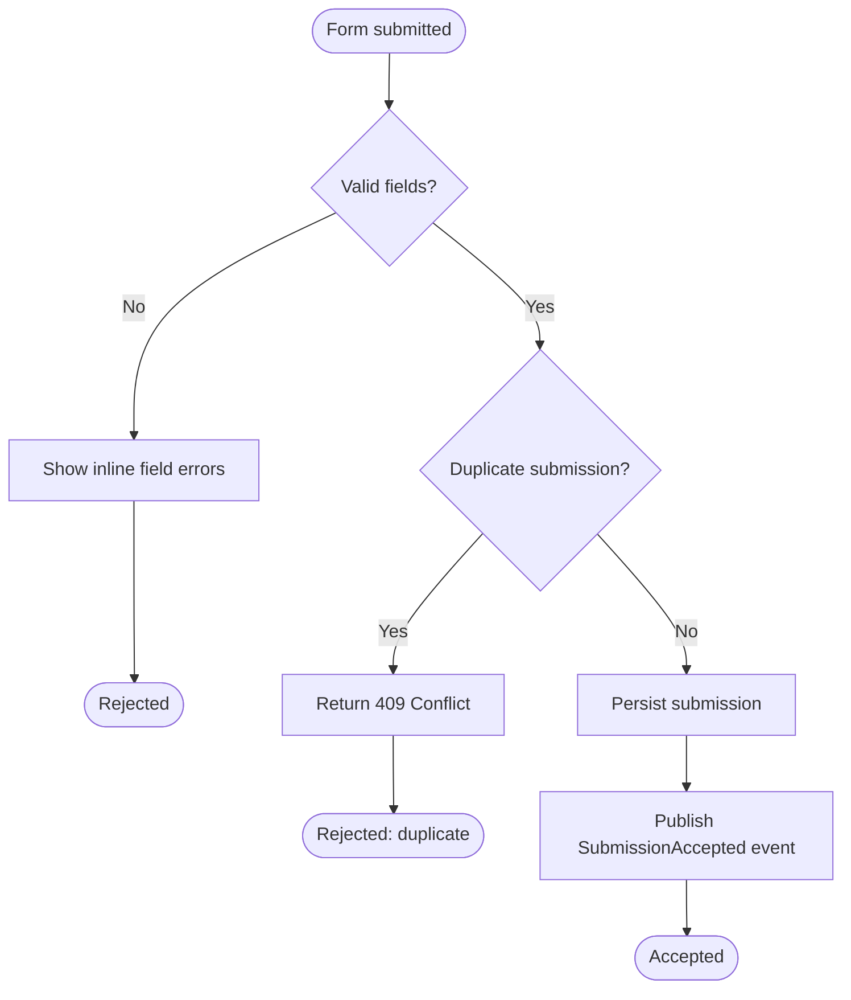

# Flowcharts

A flowchart shows decision logic or a process pipeline — no distinct actors exchanging messages over time. That's the line that separates it from a sequence diagram: if the request is "who calls whom," it's a sequence diagram; if it's "what path does this decision/process take," it's a flowchart. Using a flowchart for an interaction between systems hides who owns each step; using a sequence diagram for a decision tree buries the branching in actor swimlanes that don't exist.

## Gather required input

- **The process or decision** being diagrammed (e.g., "how a submitted form gets validated and routed", "the retry/backoff logic for a failed job").
- **Every distinct branch** — each condition and its outcomes, not just the happy path.
- **Terminal states** — where the process actually ends (success, failure, each distinct exit), not just "and then it's done."

If a branch's condition or outcome is unclear, ask rather than inventing a plausible-sounding one — a flowchart that invents logic the code doesn't have is actively misleading.

## Structural rules

- `stadium` shape (`([...])`) for start/end nodes — exactly one clear start, and a labeled end node per distinct terminal state (don't collapse "success" and "failure" into one unlabeled end).
- `diamond` shape (`{...}`) for every decision point, with each outgoing edge labeled with the condition that takes it (`Yes`/`No`, or the actual condition text — whichever is clearer for that branch).
- `rectangle` (`[...]`) for a process/action step — one node per real action, not a step that bundles three things happening at once.
- Use `flowchart TD` (top-down) for a process with more sequential depth than breadth; `flowchart LR` (left-right) when steps are wide and shallow (a short pipeline with fan-out).
- Real names for anything that maps to actual code (a function, a state, a status value) — a generic "Process data" node is worse than no node when the real function name would fit.

## Output format

- An H2 title naming the process or decision being diagrammed.
- The ```mermaid block.
- If any node abbreviates a real function/state name, a short list below mapping the label to the real identifier.

## Example

Process: "validating and routing a submitted form."



## Common rationalizations

| Rationalization | Reality |
|---|---|
| "It's basically two systems talking, a flowchart is simpler" | If there are distinct actors exchanging messages over time, that's a sequence diagram — a flowchart hides who does what. |
| "The happy path is the important part" | The branches are usually why someone asked for the diagram — an incomplete decision tree is more misleading than no diagram. |
| "One generic 'Process' box covers these three steps" | Bundling steps hides which one actually fails when something goes wrong — one node per real action. |

## Red flags

- A flowchart used to show messages between distinct actors/systems (should be a sequence diagram instead)
- A decision diamond with unlabeled edges
- Multiple terminal states collapsed into one unlabeled end node
- Invented conditions or outcomes not confirmed against the real logic

## Verification

- [ ] Every decision point is a diamond with labeled edges for every outcome
- [ ] Every terminal state has its own labeled end node
- [ ] Node labels use real function/state names where they map to code, not generic placeholders
- [ ] The diagram represents a process/decision, not actor-to-actor messaging (that belongs in a sequence diagram)
