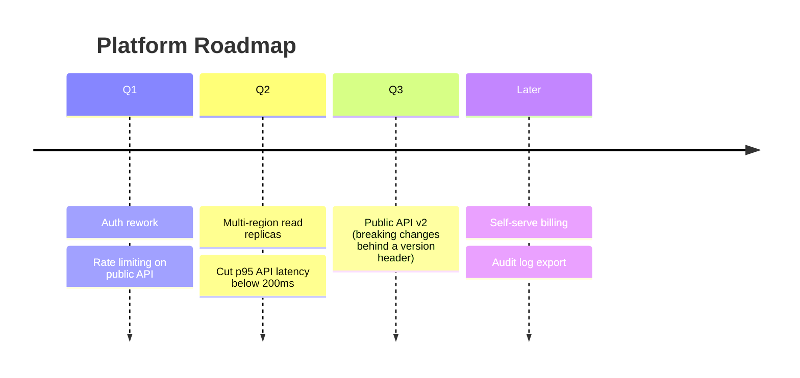
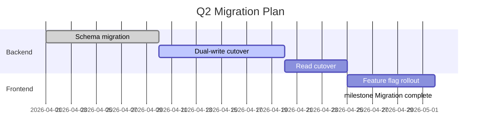

# Roadmap diagrams

A roadmap communicates sequencing and scale over time — what's coming, in what order, and roughly how big each piece is. Pick the Mermaid diagram type based on how firm the dates actually are; forcing hard dates onto a roadmap that doesn't have them yet is a fabrication, not a diagram.

## Pick the type

| Type | Use when | Mermaid diagram type |
|---|---|---|
| Timeline | Phases/themes in order, dates soft or absent (quarters, "now/next/later") | `timeline` |
| Gantt | Real dates, durations, and dependencies are known and meant to be tracked | `gantt` |

Don't default to `gantt` because it looks more official — a `gantt` chart asserts specific start/end dates and dependencies. If those aren't real yet (most roadmaps at the planning stage), a `timeline` is the honest representation; use `gantt` only once the schedule is a real commitment, not an aspiration.

## Gather required input

- **The items** being sequenced — real initiatives/features, not vague themes ("Q2: performance" is weaker than "Q2: cut p95 API latency below 200ms").
- **The grouping** — quarters, phases, or milestones, whichever the audience actually plans around.
- **For `gantt` only**: real start dates, durations, and dependencies between items — ask rather than inventing a plausible-looking schedule.

If the user hasn't said whether dates are firm, ask — this decides which diagram type is honest to use, not just a style preference.

## Structural rules (timeline)

- One section per phase/period (a quarter, a milestone name) — don't mix granularities in one diagram (quarters next to specific months).
- Each item under its section states the real deliverable, not a category label alone.

## Structural rules (gantt)

- `dateFormat` and real dates — never placeholder dates that look real but aren't.
- Use `after <task-id>` for genuine dependencies instead of guessing an end date that happens to line up.
- Mark completed/in-progress work with `done`/`active` tags so the roadmap reflects actual status, not just the plan.
- Milestones (`milestone` tag) for dates that mark a moment, not a duration.

## Output format

- An H2 title naming what the roadmap covers and its time horizon.
- The ```mermaid block.

## Example: Timeline (soft dates)



## Example: Gantt (firm dates)



## Common rationalizations

| Rationalization | Reality |
|---|---|
| "Gantt looks more professional, let's use it" | A Gantt chart asserts firm dates and dependencies — using it for a soft, aspirational roadmap fabricates certainty that isn't real. |
| "Close enough dates are fine, nobody checks" | Someone will plan against those dates. A `timeline` avoids the false precision instead of quietly misleading. |
| "One vague theme per quarter is enough detail" | A theme with no real deliverable underneath tells the reader nothing they can plan around. |

## Red flags

- `gantt` used when no real start dates/durations/dependencies exist yet
- Placeholder dates that look precise but were invented
- Mixed time granularities in one timeline (quarters next to specific months)
- A quarter/phase with only a category label and no real deliverable

## Verification

- [ ] `timeline` vs `gantt` choice matches whether the dates are actually firm
- [ ] Every item names a real deliverable, not just a category
- [ ] (Gantt only) dependencies use `after <task-id>`, not guessed end dates; status tags (`done`/`active`) reflect reality
